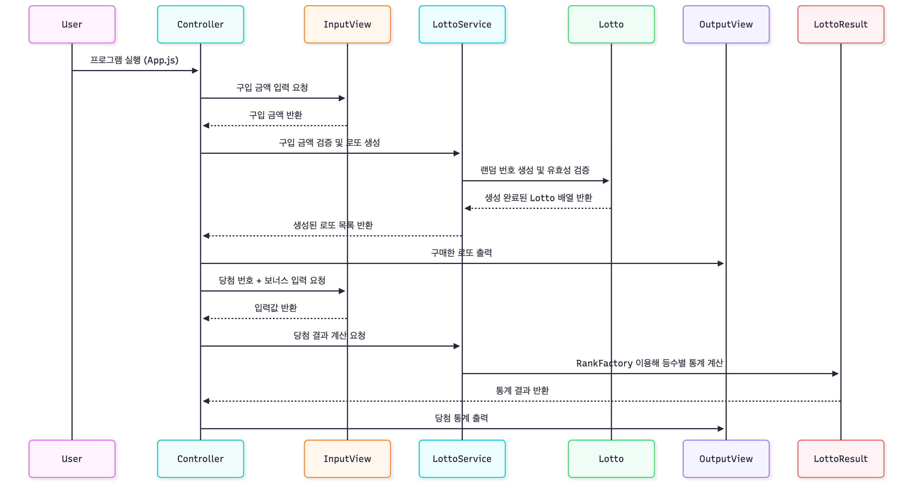
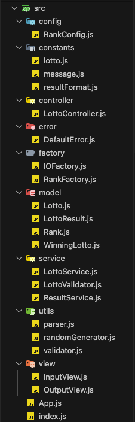

# javascript-lotto-precourse

사용자의 입력을 기반으로 로또 구매, 발행, 당첨 결과 계산, 수익률 산출까지 수행하는 콘솔 기반 로또 발매기 프로젝트입니다.

## 기능 요구사항 요약

- 로또 구매 금액 입력

  - 1,000원 단위로 입력
  - 1,000원 단위로 나누어 떨어지지 않는 경우 예외 처리

- 당첨 번호 입력

  - 쉼표 기준으로 구분
  - 0 ~ 45 중 6개 숫자 입력

- 보너스 번호 입력

  - 0 ~ 45 중 1개 숫자 입력

- 로또 수량 및 번호 출력

  - 로또 번호는 오름차순 정렬

- 당첨 내역 출력

  - 1,2,3,4,5등 일치 항목 중 몇개 일치했는지 출력

- 수익률 출력

  - 소수점 둘째 자리에서 반올림

- 예외 메시지 출력

 

## 기능 체크리스트

#### 로또 구입

- [x] 구입 금액 입력
- [x] 구입 금액에 맞게 로또 개수 발행
- [x] 1,000 단위로 나누어 떨어져야 함

#### 로또 발행

- [x] 한 장당 1 ~ 45 사이 중복되지 않는 6개 번호 랜덤 발행
- [x] 번호 오름차순 정렬
- [x] 구매 개수 및 로또 번호 목록 출력

#### 당첨 번호 및 보너스 입력

- [x] 당첨 번호를 쉼표를 구분하여 입력
- [x] 입력된 번호는 6개
- [x] 각 번호는 1 ~ 45 사이의 정수
- [x] 당첨 번호 이외 보너스 번호 입력

#### 당첨 결과 계산

- [x] 구매한 모든 로또 번호와 당첨 번호 비교
- [x] 일치 개수 + 보너스 번호 포함 여부 계산
- [x] 일치 개수와 보너스 일치 여부 기준으로 등수 판별
- [x] 등수 갯수 집계
- [x] 총 상금 합산
- [x] 수익률 계산

## 예외 체크리스트

#### 구입 금액 관련 예외

- [x] 구입 금액이 숫자가 아님
- [x] 음수 또는 0원
- [x] 1,000원 단위가 아님
- [x] 소수점 입력
- [x] 입력이 공백 or 비어있을 때

#### 당첨 번호 입력 관련 예외

- [x] 쉼표로 구분되지 않은 입력 -> '1 2 3 4 5 6'
- [x] 숫자 외 문자 포함
- [x] 숫자 6개 미만
- [x] 숫자 6개 초과
- [x] 중복된 번호 존재
- [x] 숫자 범위 초과 (1 미만 or 45 초과)
- [x] 공백 또는 빈 입력

#### 보너스 번호 입력 관련 예외

- [x] 숫자가 아닌 입력
- [x] 범위 초과 (1 미만 or 45 초과)
- [x] 당첨 번호와 중복
- [x] 공백 또는 빈 입력

## 구현 내용

### 아키텍처 구조

> 전반적인 프로젝트 구조와 각 클래스의 역할에 대해 간단히 정리한 섹션입니다.

 

3주차 프로젝트는 이전 2주차와 마찬가지로 MVC 패턴 기반의 아키텍처를 선택하여 설계했습니다.
 
이전 피드백을 기반으로 CustomError 클래스를 만들어 전체 에러 발생 로직을 통일시켰으며, 입출력 객체 생성 및 게임 규칙이 저장된 객체 생성은 각각 팩토리 패턴을 통해 관리하도록 했습니다.

 

#### 서비스 시퀀스 다이어그램

|                  서비스 흐름 다이어그램                  |
| :------------------------------------------------------: |
|                   |
| 로또 프로젝트의 서비스 흐름을 나타내는 다이어그램입니다. |

 

|                      프로젝트 폴더 구조                      |
| :----------------------------------------------------------: |
|                                |
| 프로젝트 주요 클래스 및 역할을 나타내는 디렉터리 구조입니다. |

### 구조 별 설명

1️⃣ Model (도메인 로직 관리)

| 클래스       | 역할                                                                                                                      |
| :----------- | :------------------------------------------------------------------------------------------------------------------------ |
| Lotto        | 한장의 로또 티켓을 표현,   입력된 숫자 배열의 유효성 검증,   당첨 번호와 일치하는 개수를 계산,                    |
| WinningLotto | 당첨 번호 + 보너스 번호 관리 클래스,   Lotto와 비교하여 매칭 결과를 생성하는 핵심 도메인 객체                         |
| Rank         | 하나의 '당첨 등수'를 나타내는 객체,   매칭 개수와 보너스 여부 기반으로 순위 구분,   순위 별 상금 금액도 함께 보관 |
| LottoResult  | 로또 결과를 집계하여 총 상금, 수익률 등 최종 결과를 관리하는 객체                                                         |

2️⃣ Controller

| 클래스          | 역할                                                                                                  |
| :-------------- | :---------------------------------------------------------------------------------------------------- |
| LottoController | 프로그램 전체 흐름을 제어하는 클래스,   예외 발생 시 해당 단계부터 지속할 수 있도록 입력단계 제어 |

3️⃣ Service

| 클래스         | 역할                                                                                                                                   |
| :------------- | :------------------------------------------------------------------------------------------------------------------------------------- |
| LottoService   | 구입 금액을 기반으로 로또 생성 및 당첨 결과 계산 담당,   모델 객체(Lotto, WinningLotto, LottoResult)를 연결하는 비즈니스 로직 계층 |
| ResultService  | 계산된 결과(LottoResult)를 파싱하여 출력 데이터로 변환,   뷰 계층과 모델 계층 사이의 변환자 역할을 수행하도록 설계                 |
| LottoValidator | 금액, 번호 입력 등 다양한 도메인 관련 검증 로직 수행                                                                                   |

4️⃣ View

| 클래스     | 설명                                                           |
| :--------- | :------------------------------------------------------------- |
| InputView  | 사용자로부터 구입 금액, 당첨 번호, 보너스 번호를 입력받는 역할 |
| OutputView | 로또 구입 결과, 당첨 통계, 예외 메시지 등을 출력               |

5️⃣ Factory

| 클래스      | 역할                                                                            |
| :---------- | :------------------------------------------------------------------------------ |
| IOFactory   | InputView와 OutputView 객체의 생성 및 관리를 담당하는 객체                      |
| RankFactory | 매칭 개수와 보너스 번호 여부에 따라 적절한 Rank 객체를 생성하도록 관리하는 객체 |

6️⃣ error

| 클래스 | 역할 |
| :----- | :--- |
